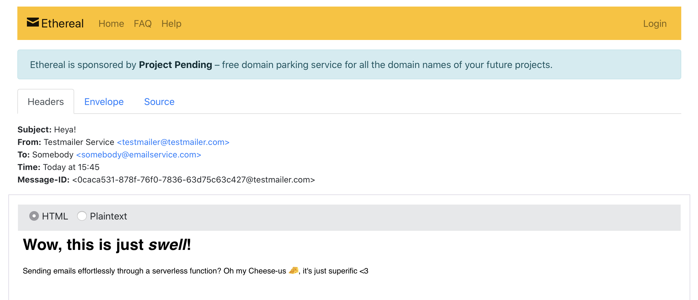

# Test mailer service on Google Cloud Functions

Send short-lived test emails 'serverlessly' with a Google Cloud Function, using the [Nodemailer](https://nodemailer.com/about/) library, then receive the messages on [Ethereal](https://ethereal.email).

Good for when you need to set up a basic email service and/or test out how those emails look. All of this on serverless functions in Google Cloud Platform!

## Prerequisites

- You need a Google Cloud Platform account

## Setup

- Log into GCP with `gcloud auth login`
- Set your project with `gcloud config set project [PROJECT_NAME]`
- Enable Cloud Functions API with `gcloud services enable cloudfunctions.googleapis.com`

## Deploy

- **Mac/Linux**: Easiest is to just deploy the function with `sh deploy.sh`
- **Windows**: Just copy the code in `deploy.sh` and run it. Replace the `region` bit by inlining your region.

## Running the function

Send a valid payload containing all seven required arguments. Demo below:

```
{
  "senderName": "Testmailer Service",
  "senderEmail": "testmailer@testmailer.com",
  "recipientName": "Somebody",
  "recipientEmail": "somebody@emailservice.com",
  "subject": "Heya!",
  "text": "Wow, this is just swell! Sending emails effortlessly through a serverless function? Oh my Cheese-us &#129472;, it's just superific <3",
  "html": "<h1>Wow, this is just <em>swell</em>!</h1><p>Sending emails effortlessly through a serverless function? Oh my Cheese-us &#129472;, it's just superific <3</p>"
}
```

You should get back something like:

```
{
  "body": "\"https://ethereal.email/message/XsfWh.LJswQ7pOZtXsfXYSSvmwacJtCmAAAAA77LgcKp1F4Jt0Jg81EY8pI\""
}
```

Going to the URL, you should be seeing the Ethereal preview looking something like this:


